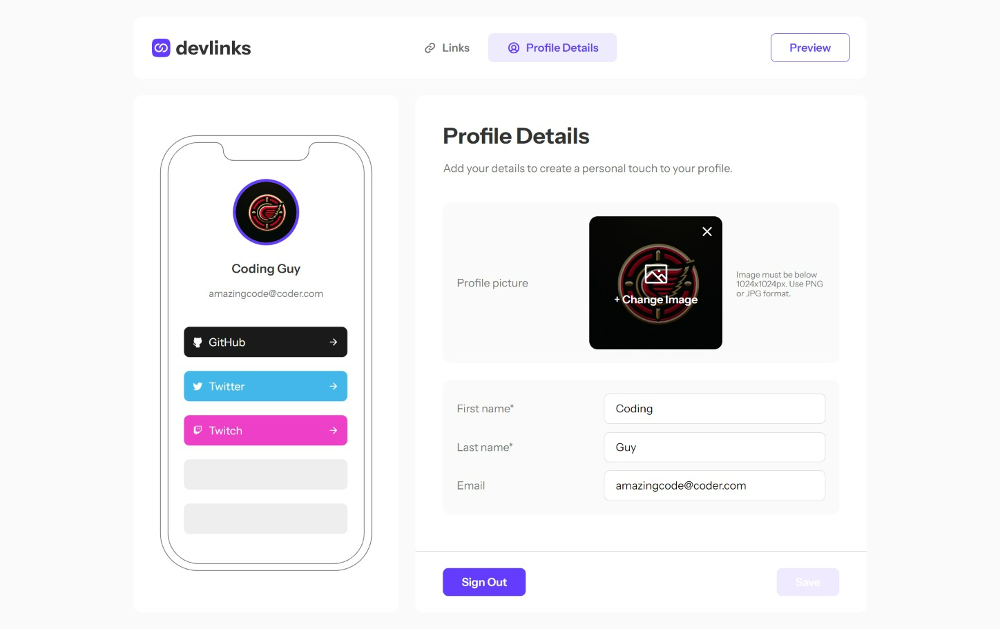

# Frontend Mentor - Link-sharing app solution

This is a solution to the [Link-sharing app challenge on Frontend Mentor](https://www.frontendmentor.io/challenges/linksharing-app-Fbt7yweGsT). Frontend Mentor challenges help you improve your coding skills by building realistic projects. 

## Table of contents

- [Frontend Mentor - Link-sharing app solution](#frontend-mentor---link-sharing-app-solution)
  - [Table of contents](#table-of-contents)
  - [Overview](#overview)
    - [The challenge](#the-challenge)
    - [Screenshot](#screenshot)
    - [Links](#links)
  - [My process](#my-process)
    - [Built with](#built-with)
    - [What I learned](#what-i-learned)
    - [Continued development](#continued-development)
    - [Useful resources](#useful-resources)
  - [Author](#author)
  - [Acknowledgments](#acknowledgments)

## Overview

### The challenge

Users should be able to:

- Create, read, update, delete links and see previews in the mobile mockup
- Receive validations if the links form is submitted without a URL or with the wrong URL pattern for the platform
- Drag and drop links to reorder them
- Add profile details like profile picture, first name, last name, and email
- Receive validations if the profile details form is saved with no first or last name
- Preview their devlinks profile and copy the link to their clipboard
- View the optimal layout for the interface depending on their device's screen size
- See hover and focus states for all interactive elements on the page
- **Bonus**: Save details to a database (build the project as a full-stack app)
- **Bonus**: Create an account and log in (add user authentication to the full-stack app)

### Screenshot



### Links

- Solution URL: [Add solution URL here](https://your-solution-url.com)
- Live Site URL: [App](https://frontendmentor-linksharing.web.app/)

## My process

### Built with

- Angular and Angular Material
- Firebase
- Flexbox
- CSS Grid

### What I learned

In developing this application, I embraced the cutting-edge features introduced in Angular versions 16 and 17, which significantly enriched my development experience and the app's functionality. I ventured into the realm of reactive programming with Angular Signals, a new feature that simplified state management and asynchronous data handling, allowing for more intuitive and declarative code patterns. The introduction of built-in control flow syntax, such as @if and @else, replaced the traditional *ngIf directive, streamlining template logic and enhancing readability. These constructs enabled me to conditionally render components with greater ease and clarity. I also adopted new injectable techniques that Angular 17 brought to the table, leveraging the inject function for more flexible and decoupled service consumption within components and services alike. Furthermore, my journey included mastering advanced Angular and RxJS concepts for robust state management, securing routes with guards and resolvers for data pre-fetching, and integrating Angular Material for a polished UI. Continuous deployment via GitHub Actions to Firebase Hosting was another milestone, underscoring the importance of CI/CD pipelines in modern web development practices. The project also deepened my understanding of Firebase Authentication and Firestore, incorporating stringent security rules to protect data integrity. Through implementing these advanced and new Angular features, alongside Firebase's scalable infrastructure, I've crafted an application that not only meets modern web standards but also leverages the latest developments in the Angular ecosystem, marking a significant milestone in my web development journey.

Below highlights the simple nature of using angular control flow added in Angular 17. No more need for ng-if or ng-repeat:

```html
@if (links$ | async; as links) {
  @if (links.length) {
    <div class="links">
      @for (link of links; track trackByFn) {
        <app-link [linkBlock]="link" [enableClick]="false"></app-link>
      }
    </div>
  }
}
```

### Continued development

As I forge ahead in my Angular mastery, I am eager to explore deeper into its comprehensive ecosystem, focusing on sophisticated techniques that elevate web development to new heights. A key area of interest is Angular Universal and its server-side rendering (SSR) capabilities, which open the door to improved SEO, faster perceived load times, and enhanced performance for mobile and low-powered devices. Embracing Angular Universal will allow me to pre-render pages on the server, delivering static pages to the browser that can be quickly displayed to users, significantly improving the first paint and time to interactive metrics. This approach not only optimizes the user experience but also ensures that web applications are more accessible to search engines, a critical factor for any modern web presence. In addition to SSR, I plan to dive into advanced state management strategies using libraries such as NgRx or Akita, providing scalable solutions for handling complex application states with efficiency and predictability. The prospect of integrating machine learning with TensorFlow.js within Angular apps presents an exciting opportunity to build intelligent features directly into the user interface, enhancing decision-making and personalization. Moreover, staying abreast of developments in Angular Material and the Component Dev Kit (CDK) will enable me to design beautiful, accessible UIs with ease. Engaging with the Angular community through contributions to open-source projects, participating in forums, and attending conferences will not only bolster my skills but also allow me to give back to the ecosystem that has been instrumental in my development journey. As the landscape of web technology continues to evolve, my commitment to learning and leveraging the latest advancements in Angular, such as Universal and SSR, ensures a future ripe with innovation, challenge, and the opportunity for continuous growth and contribution.


### Useful resources

- [Digital Ocean](https://www.digitalocean.com/community/tutorials/getting-started-with-angular-using-the-angular-cli) - This helped with a lot of the newer Angular features
- [Angular University](https://blog.angular-university.io/) - One of the best Angular developers out there

## Author

- Frontend Mentor - [@webguy83](https://www.frontendmentor.io/profile/webguy83)
- Github - [@webguy83](https://www.github.com/webguy83)


## Acknowledgments

Chat GPT is my new personal assistant. You're so amazing!
